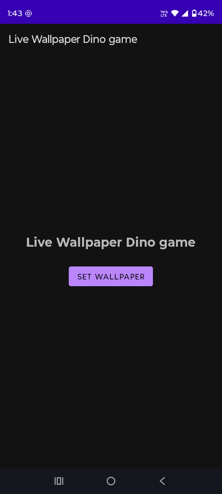

# Chrome Dino Live Wallpaper Game

A fully functional, retro-style Chrome Dino runner game implemented as an Android Live Wallpaper.

## Features
- **Playable Live Wallpaper**: Tap the screen to make the Dino jump and avoid obstacles!
- **Authentic Retro Aesthetics**: Features classic monochrome sprites, scrolling clouds, and ground obstacles.
- **Smooth Animations**: 60 FPS game loop rendering using Android's Canvas APIs.
- **Optimized Battery Usage**: Lifecycle-aware drawing ensures the wallpaper pauses when not visible, conserving system resources.
- **High Score System**: Tracks your current session performance seamlessly.

## Getting Started
1. Download the latest `.apk` from the Releases tab.
2. Install it on your Android device.
3. Open your device's Wallpaper selection settings.
4. Choose **Live Wallpapers** and select **Live Wallpaper Dino game**.
5. Set as Home / Lock screen and enjoy!

## Credits
- Inspired by the classic Chrome Offline Dino game.
- Built natively using Kotlin and the Android SDK.
