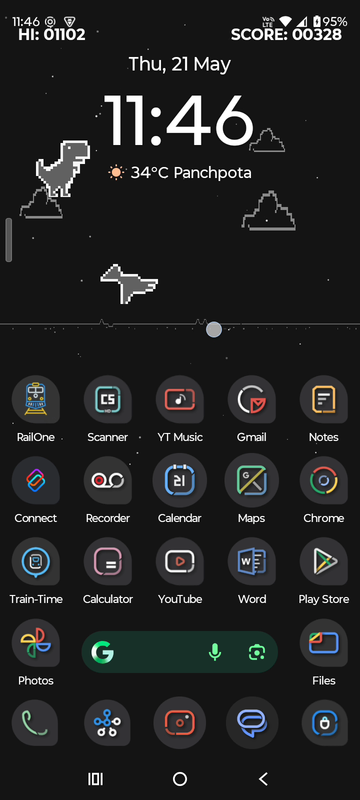
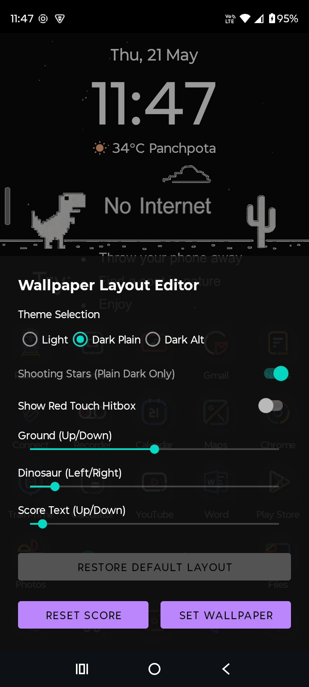
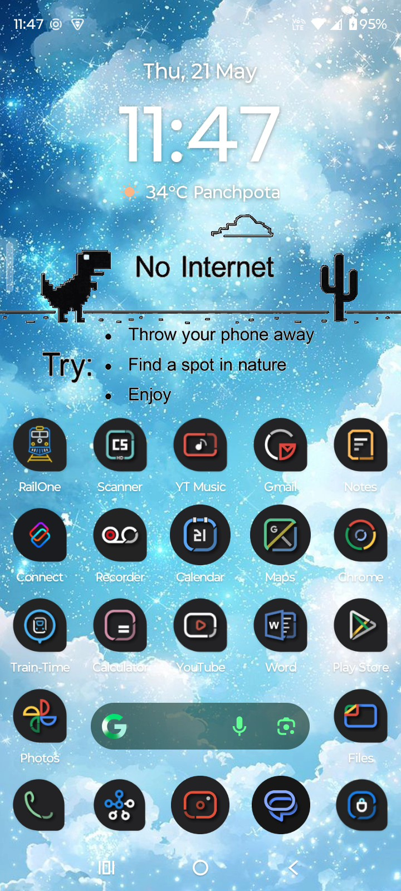
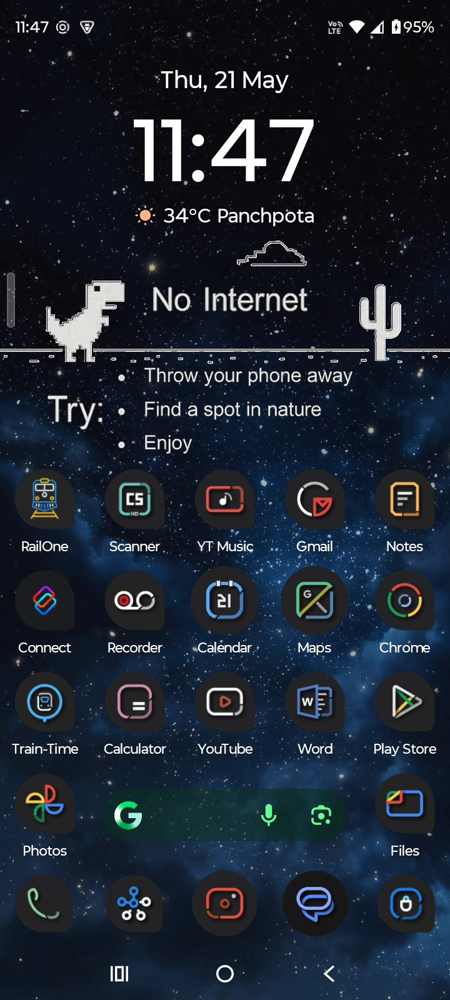
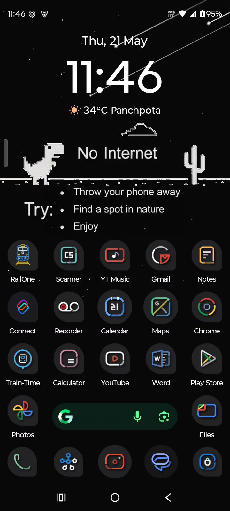

# Chrome Dino Live Wallpaper Game

A fully functional, retro-style Chrome Dino runner game implemented as an Android Live Wallpaper. Just press on the dinosaur and the game will start immediately.

  <h3>🌟 Screenshots 🌟</h3>
  <table>
    <tr>
      <td align="center"> <b>Action Packed Gameplay</b></td>
      <td align="center"> <b>Live Layout Editor</b></td>
      <td align="center"> <b>Light Mode</b></td>
      <td align="center"> <b>Dark Mode</b></td>
      <td align="center"> <b>Plain Dark Mode</b></td>
    </tr>
  </table>

  https://github.com/user-attachments/assets/efa689e3-5f7e-49d5-8785-a78cc56dc660

## Features
- **Playable Live Wallpaper**: Tap the screen to make the Dino jump and avoid obstacles!
- **Authentic Retro Aesthetics**: Features classic monochrome sprites, scrolling clouds, and ground obstacles.
- **Smooth Animations**: 60 FPS game loop rendering using Android's Canvas APIs.
- **Theming**: Integrated a Dynamic Theme Engine (Light, Dark Plain, Dark Alt) with a RadioGroup UI for seamless theme switching.
- **Visuals**: Implemented a native CSS-style Shooting Stars Particle Engine featuring linear gradient tails and glowing box-shadow heads.

## Under The Hood (Recent Updates)
- **Memory & Stability**: Prevented ANR freezes and Out-Of-Memory crashes by decoding assets on a background thread and pre-allocating objects to stop Garbage Collector thrashing.
- **Performance**: Fixed lagging and battery drain by forcing Hardware Accelerated Canvas (GPU), pre-scaling the background images once, and adding a 15-FPS idle state.
- **Persistent Data**: Integrated SharedPreferences to permanently save the high score and wired up a live slider to adjust the game's ground height on the fly.
- **Controls**: Built a dynamically scaling, percentage-based touch hitbox that perfectly detects the static dinosaur across any phone's aspect ratio.
- **Optimized Battery Usage**: Lifecycle-aware drawing ensures the wallpaper pauses when not visible, conserving system resources.

## Getting Started
1. Download the latest `.apk` from the Releases tab.
2. Install it on your Android device.
3. Open your device's Wallpaper selection settings.
4. Choose **Live Wallpapers** and select **Live Wallpaper Dino game**.
5. Set as Home / Lock screen and enjoy!

## Credits
- Inspired by the classic Chrome Offline Dino game.
- Built natively using Kotlin and the Android SDK.

## Updates
### v1.1.0
Dino Game v1.1.0 fixed crashes
1. UI Updates (activity_main.xml)
Added Ground Placement Slider: Inserted a SeekBar to allow users to adjust the vertical position of the ground and dinosaur.
Added Reset Button: Inserted a Button specifically to reset the saved high score back to zero.
2. Logic Updates (MainActivity.kt)
Implemented SharedPreferences: Added logic to save and load user preferences (ground placement and high score) persistently.
Wired Controls: Connected the SeekBar to update the "ground_placement" value dynamically, and the Reset button to clear the "high_score".
3. Optimization & Engine Updates (DinoWallpaperService.kt)
Fixed Memory Leaks (Crash/Green Screen Fix): Moved the instantiation of RectF and Paint objects out of the draw() and update() loops. Pre-allocated these objects globally to prevent the Garbage Collector from thrashing and exhausting device memory.
Implemented Battery Saver (Dynamic FPS): Modified the run() loop to throttle the frame rate down to 15 FPS when the game is idle, and instantly ramp back up to 60 FPS when the user taps to play.
Persistent High Scores: Integrated SharedPreferences into the collision detection logic to permanently save the high score when the player loses.
Dynamic Placement: Updated the update() loop to read the slider value and adjust the groundY coordinates in real-time.
Fixed Black Mask Scaling: Adjusted the blackout mask (used to hide the static background dino) to scale dynamically with the screen width instead of using a hardcoded pixel height.

### v1.2.0

- Memory & Stability: Prevented ANR freezes and Out-Of-Memory crashes by decoding assets on a background thread and pre-allocating objects to stop Garbage Collector thrashing.
- Performance: Fixed lagging and battery drain by forcing Hardware Accelerated Canvas (GPU), pre-scaling the background images once, and adding a 15-FPS idle state.
- Features: Integrated SharedPreferences to permanently save the high score and wired up a live slider to adjust the game's ground height on the fly.
- Controls: Built a dynamically scaling, percentage-based touch hitbox that perfectly detects the static dinosaur across any phone's aspect ratio.

### v1.3.0
## ✨ What's New

* **Live Layout Editor (WYSIWYG):** Customize the wallpaper directly from your home screen! The app now features a transparent control panel allowing you to adjust the Ground Height, Dinosaur Position, and Score Margin on the fly with live sliders.
* **Dynamic Theme Engine:** Instantly switch between **Light**, **Plain Dark**, and **Alt Dark** modes without needing to restart the wallpaper.
* **Live Sky & Shooting Stars:** The Dark theme now features a fully animated night sky with twinkling background stars and CSS-style fading shooting stars that streak across your home screen.
* **The Birds are Here:** Pterodactyls have entered the chat! Once you cross a score of 300, flying enemies will begin spawning at three different heights, requiring you to time your jumps and ducks perfectly.
* **"Panic Button" Reset:** Messed up your layout? A new "Restore Defaults" button instantly snaps your wallpaper back to factory-perfect alignment.

## 🛠 Under the Hood (Performance & Stability)

* **Zero-Crash Rotation (Atomic Swapping):** Completely re-engineered the screen rotation logic. Transitioning from portrait to landscape now uses atomic bitmap swapping, permanently fixing the "grey screen" rotation crash and preventing Out-Of-Memory (OOM) leaks.
* **Universal Screen Scaling:** Hardcoded pixels are gone. The game’s touch hitbox, text size, and element spacing are now strictly percentage-based, guaranteeing a pixel-perfect experience on any device—from budget 720p screens to extra-tall 1440p flagships.
* **Battery Saver Mode:** The game loop now flawlessly downshifts CPU/GPU usage by 75% (dropping to 15 FPS) the moment the game is idle, keeping your battery safe while maintaining a beautiful static wallpaper.
* **Clean Build Output:** The compiled release file is now cleanly output as `Dino_game.apk`.
